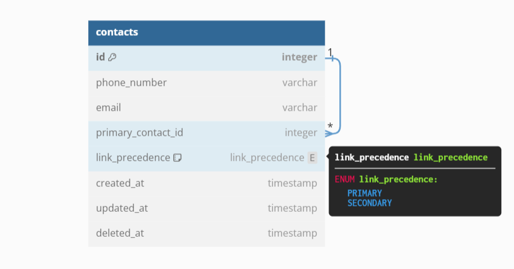
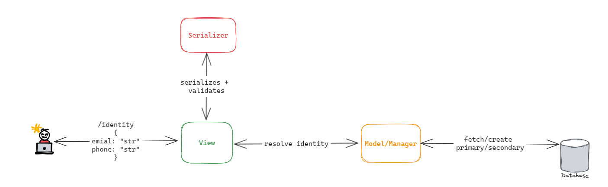

# Identity Resolver
|                                |                                |
| ------------------------------ |  ----------------------------  |
|  |  |
## Notes:

* commits are small with insightful messages
* Deployed on [render](https://render.com) free instance type, so you the first request might take a minute
    * *Web Services on the free instance type are automatically spun down after 15 minutes of inactivity*
* Swagger UI -> https://identity-resolver.onrender.com/api/schema/docs/

## API
```JSON
POST https://identity-resolver.onrender.com/api/contact/identity

REQUEST
{
  "phoneNumber": "+1234567890",
  "email": "cde@g.com"
}

RESPONSE
{
  "contact": {
    "primaryContactId": 1,
    "emails": [
      "abc@g.com",
      "lorraine@hillvalley.edu",
      "mcfly@hillvalley.edu",
      "cde@g.com"
    ],
    "phoneNumbers": [
      "+1234567890",
      "+4564567890",
      "+7894567890",
      "+998899889988",
      "+9994567890"
    ],
    "secondaryContactIds": [
      2,
      3,
      5,
      6,
      7,
      10,
      11
    ]
  }
}
```
#### Setup:
1. create venv, using 
    `python -m venv venv`
2. activate the environment 
    ``` BASH
    Ubuntu `source venv/bin/activate`
    Windows Powershell `venv\Scripts\Activate.ps1`
    Windows CMD `venv\Scripts\activate.bat`
    ```
3. install dependencies
    `pip install -r requirements.txt`
4. connect with local DB instance at `project/settings.py`
    ```
    DATABASES = {
        'default': {
            'ENGINE': 'django.db.backends.<db_name>',
            'NAME': '<schema_name>',
            'USER': '<user_name>',
            'PASSWORD': '<password>',
            'HOST':'localhost',
            'PORT':'3306',
        }
    }
    ```
5. make migrations, migrate and runserver

    ``` Bash
    python manage.py makemigrations
    python manage.py migrate

    python manage.py runserver 8000
    ```